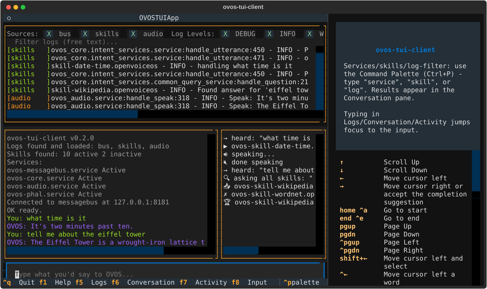
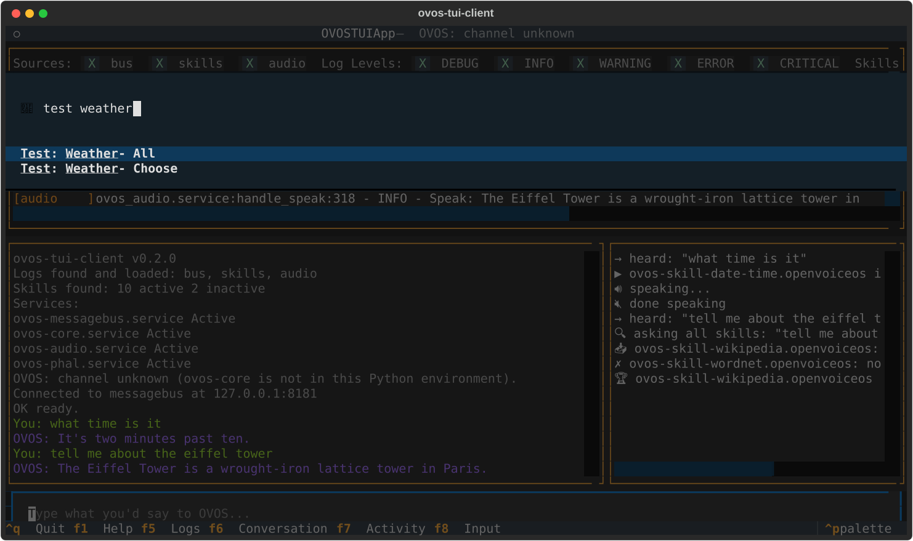

# Getting started

## Install

```bash
pip install ovos-tui-client
```

The OVOS installer can also install it for you. To try a pre-release,
add `--pre`:

```bash
pip install --pre -U ovos-tui-client
```

A container image is published too - see [Web and Docker](web-and-docker.md).

## Start it

```bash
ovos-tui
```

It connects to the messagebus at `127.0.0.1:8181`. On another machine,
or in another language:

```bash
ovos-tui --host 192.168.1.50 --lang da-dk
```

### All options

| Option | What it does |
|---|---|
| `--host`, `--port` | Messagebus address (default `127.0.0.1:8181`). |
| `--lang` | Language of what you type, and of the tests that run (default `en-us`). |
| `--log-dir DIR` | Where the OVOS logs are. Normally found automatically. |
| `--mycroft-conf FILE` | The `mycroft.conf` the pipeline view should read. Only needed on some Docker/Podman installs. |
| `--golden-dir DIR` | Local skill checkouts to take test utterances from, before GitHub. Can be given more than once. See [Testing skills](testing.md#where-the-test-utterances-come-from). |
| `--scripts-dir DIR` | Folder with your own scripts (default `~/.config/ovos-tui-client/scripts`). |
| `--web`, `--web-host`, `--web-port`, `--web-public-url` | Serve the TUI in a browser. See [Web and Docker](web-and-docker.md). |

## The screen


From the top:

1. **Logs.** Tick sources (`bus`, `skills`, `audio`, …) or log levels to
   narrow down. With nothing ticked in a row, everything in that row
   shows. The free-text filter and the `Skills` filter work the same
   way. Scroll up to read, and new lines won't pull you back down.
2. **Conversation** (left). `You:` in green, `OVOS:` in purple, and grey
   status lines for what the tool itself does (startup, service
   restarts, skill changes).
3. **Activity** (right). What OVOS is doing: `→ heard`, which skill
   matched (`▶`), speaking, which common-query skills answered (`✗` for
   those that had nothing).
4. **Input** at the bottom. Type and press Enter, as if you had said it.
   Up/Down browse what you typed before.

If you start typing while another pane has focus, the keys go to the
input anyway.

## Keys

| Key | |
|---|---|
| `Ctrl+P` | Command palette |
| `F1` | Help panel |
| `F5` / `F6` / `F7` / `F8` | Focus Logs / Conversation / Activity / Input |
| `Tab`, `Shift+Tab` | Move focus |
| `Esc` | Close a window |
| `Ctrl+Q` | Quit |



## The command palette

Almost everything besides typing lives in the command palette. Press
`Ctrl+P` and type a few letters of what you want:



| Start typing… | to find |
|---|---|
| `test` | `Test: <Skill> - All`, `- Choose`, `- Last selection`, `Test: All installed skills` |
| `script` | Your own scripts, and `Script: Stop running script` while one runs |
| `about` | `About: <Skill>`, `About: Installed skills`, `About: ovos-tui-client` |
| `skill` | `Skill: Activate / deactivate…`, and one `Skill: <id> (Active/Inactive)` entry per skill that toggles it |
| `example` | Example phrases from the installed skills. Selecting one sends it. |
| `service` | Start, stop or restart OVOS services |
| `pipeline` | The intent pipeline in the order OVOS evaluates it |
| `log` | Log filters: sources, levels, skills |
| `clear` | `Clear: Logs`, `Conversation`, `Activity`, `All` |

Results are written to the conversation pane rather than to pop-ups.
The only windows are the ones where you pick or read something:
the test picker and the About windows.
