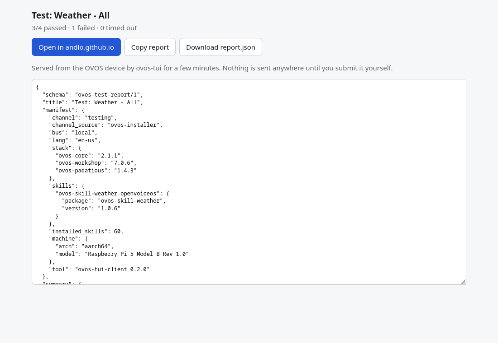

# Headless test runs and reports

The same tests you run from the palette ([Testing skills](testing.md)) can
run **without the terminal UI**, from the command line. Use it for a
scheduled run (cron, a systemd timer), for CI, or to make a **report** you
can share: with a skill's maintainer, in an issue, or with a skill store.

```bash
ovos-tui --run all
ovos-tui --run ovos-skill-weather.openvoiceos
ovos-tui --run ~/.config/ovos-tui-client/scripts/smoke.jsonl
```

!!! warning "These are real utterances"
    Exactly as in the UI: the sentences go to your live OVOS, so timers,
    alarms and media really happen. Every step runs in its own session,
    and that session is stopped afterwards.

## What it does

1. Connects to the messagebus (`--host`, `--port`, default `127.0.0.1:8181`).
2. Waits for OVOS to list its skills, asking again a few times if it is
   busy (same as the UI). If it never answers, nothing is tested.
3. Looks up the golden utterances for what you asked for, in your
   `--lang`: `all` means every installed, active skill; a `skill_id` means
   that skill; a `.jsonl`/`.txt` file is one of [your own scripts](scripts.md).
4. Runs every step and prints one line each:

    ```
    [1/4] ✓ "what's the weather"  ovos-skill-weather.openvoiceos:weather.intent
    [2/4] ✗ "will it rain"  expected ovos-skill-weather.openvoiceos, got ovos-skill-wolfie.openvoiceos
    Test: ovos-skill-weather.openvoiceos: 3/4 passed · 1 failed · 21s
    ```

5. Saves the result, like **Test: Save result** in the TUI: a readable
   `.md` and the shareable `.report.json` (below), which also says what was
   tested against.

**Exit code:** `0` every checked step passed, `1` something failed or timed
out (or the run was stopped with Ctrl+C), `2` it could not run: no bus, no
skill list, or nothing to test.

## Options

| Option | |
|---|---|
| `--run TARGET` | `all`, a skill_id, or a script file. |
| `--lang` | The language of the utterances (default `en-us`). |
| `--output DIR` | Where the `.md` and `.report.json` go (default `~/.local/share/ovos-tui-client/results`). |
| `--report FILE` | Also put a copy of the report in FILE (below). `-` prints it, for copy-paste; progress then goes to stderr. |
| `--report-replies` | Include what OVOS said in the report. Off by default. |
| `--channel NAME` | The release channel of this install, if it can't be worked out automatically (below). |
| `--notes TEXT` | Free text for the report, e.g. what the skill needs: `"OpenWeather API key set"`, `"Mark II"`. |
| `--submit-url TEMPLATE` | A skill store's report link, so the share page can open the store with the report filled in (below). Asked for when not set. |
| `--share` / `--no-share` | Serve the report on a short link even when not run from a terminal / never. From a terminal it's shared by itself. |
| `--golden-dir DIR` | Local skill checkouts to take golden utterances from, before GitHub. |

## What was tested against: the manifest

A result is only useful if it says exactly which install produced it. The
manifest records:

- **channel:** the OVOS release channel (`stable`, `testing`, `alpha`) and
  how it was found (`channel_source`). What the install declares (the OVOS
  installer's state file, raspOVOS's `/opt/ovos/tag`) is checked against the
  installed versions and each channel's constraints file as it is today;
  with nothing declared, as on Docker, Buildroot or a hand-made venv, the
  versions alone decide. `--channel` overrides it. See
  [Release channels](channels.md).
- **stack:** the versions of the packages that decide how skills load and
  where an utterance goes: ovos-core, ovos-workshop, ovos-bus-client,
  ovos-plugin-manager, the intent engines, the pipeline plugins.
- **skills:** each tested skill's package and version.
- **installed:** every skill on the device (id, package, version, active),
  not only the tested ones, so a reader can see what the test ran alongside.
  **pipeline_plugins:** the installed pipeline plugins and their versions
  (which stages *could* run; the order that does run is `config.pipeline`).
- **steps_from / steps_note:** where each skill's steps came from, and a
  note when golden files came from a repo's default branch (possibly newer
  than the installed release).
- **config:** `lang`, `secondary_langs`, the intent pipeline order, and the STT and TTS plugin names (only the names: a plugin's own settings can hold keys or server addresses, so they are never read into the report).
- **machine:** architecture, and the board model when there is one
  (`Raspberry Pi 5`, a Mark II ...).
- when, and which ovos-tui-client version.

!!! note "Run it on the device itself"
    The versions are read from the Python environment ovos-tui-client runs
    in. The OVOS installer puts ovos-tui-client in the same environment as
    OVOS, so on the device they are OVOS's own. Pointed at a bus on another
    machine (`--host`), they would describe the wrong install, so they are
    left out and the manifest says `"versions_from": "unavailable"`.

## The shareable report

Every run saves one JSON document, `ovos-test-report/1`, as `….report.json`
next to the `.md`, with the manifest, a summary and one row per step.
`--report` puts a copy where you want it, or prints it:

```json
{
  "schema": "ovos-test-report/1",
  "title": "Test: ovos-skill-weather.openvoiceos",
  "manifest": {
    "channel": "testing", "channel_source": "ovos-installer", "bus": "local",
    "stack": { "ovos-core": "2.1.0", "ovos-workshop": "7.0.6", "...": "..." },
    "skills": { "ovos-skill-weather.openvoiceos": { "package": "ovos-skill-weather", "version": "1.2.0",
                                                    "steps_from": "https://raw.githubusercontent.com/..." } },
    "installed": [ { "id": "ovos-skill-alerts.openvoiceos", "package": "ovos-skill-alerts", "version": "0.1.28", "active": true },
                   "..." ],
    "pipeline_plugins": { "ovos-common-query-pipeline-plugin": "1.1.9", "...": "..." },
    "config": { "lang": "en-us", "secondary_langs": ["da-dk"], "pipeline": ["..."],
                "stt": "ovos-stt-plugin-server", "tts": "ovos-tts-plugin-piper" },
    "machine": { "arch": "aarch64", "model": "Raspberry Pi 5 Model B Rev 1.0" },
    "created_at": "2026-10-04T18:12:00Z", "tool": "ovos-tui-client 0.3.0"
  },
  "summary": { "steps": 4, "checked": 4, "passed": 3, "failed": 1, "answered": 4, "...": "..." },
  "steps": [
    { "i": 1, "utterance": "what's the weather", "lang": "en-us",
      "expected": "ovos-skill-weather.openvoiceos:weather.intent", "status": "pass",
      "handled_by": "ovos-skill-weather.openvoiceos:weather.intent", "answered": true }
  ],
  "notes": "OpenWeather API key set"
}
```

**Private by default.** The report holds no hostname, IP address, user name
or home path, and nothing from any skill's settings, where API keys live.
OVOS's replies are left out too, because they can contain personal data
("it's 14 degrees in *your town*"); the report only says whether OVOS
answered. Add them with `--report-replies` for a report you keep yourself.
Read the report before you share it; it is plain JSON.

## Getting the report off the device

ovos-tui-client does not know about any skill store or service, and sends
nothing anywhere by itself. You decide where a report goes. Most people
test on the OVOS device over ssh, where the clipboard is the hard part, so
there are several ways:

- **A short link (from a terminal, by itself).** When you run it from a
  terminal, the report is served on a short, temporary link from the
  device, and the command it needs to fetch the file is printed:

    ```text
    Open the report in your browser (Ctrl+click): http://192.168.1.50:41733/q3v9XcA2Lk0e/
      Copy, Download, and 'Open in' the store with the report filled in. The link works for 15 min.
    Or fetch the file: scp ovos@192.168.1.50:/home/ovos/.local/share/ovos-tui-client/results/2026-10-01_101500_test-ovos-skill-weather-openvoiceos.report.json .
    Press Enter when you're done with the link...
    ```

    Ctrl+click (or copy) the link on your own computer. The page shows the
    report with **Copy report** and **Download report.json**, and, when a
    store link is set (below), **Open in &lt;store&gt;**:

    

    The link is read-only, carries a random token, serves this one report
    and stops when you press Enter or after 15 minutes. It works on the
    same network as the device. `--no-share` turns it off; `--share` also
    serves it from a script (it then stays up the 15 minutes).
- **The file:** the `….report.json` in the results folder (or a copy where
  you want it with `--report report.json`). Fetch it with the printed `scp`
  command and attach or upload it.
- **Copy-paste:** `--report -` prints it; paste it where you want it.

### A skill store's report link

A store can give a link template that opens its own page with the report
filled in. You don't submit anything from the device: the store's page
shows the report, checks it, and you submit it there yourself.

When no store link is set and you run from a terminal, ovos-tui-client asks
for it, and says that it never submits anything. Paste the link from the
store's instructions, or press Enter to skip; a skipped question comes back
next time. Set or change it any time:

- `--submit-url 'https://…'` on the command line,
- in the TUI: `Ctrl+P` → **`Settings: Skill store report link`**,
- or in `~/.config/ovos-tui-client/config.json`:

    ```json
    { "submit_url": "https://example.org/report?skill={skill_id}#report={report_fragment}" }
    ```

Placeholders, each filled in and URL-encoded:

| Placeholder | |
|---|---|
| `{report_fragment}` | The report packed for the part of a link after `#`: gzip, then base64url. That part never goes to a server, and a one-skill report is ~2-5 KB. Preferred. |
| `{report}` | The report as JSON, for a query string. Limited to about 8 KB; longer reports say so. |
| `{skill_id}` | The tested skill, when there is one. |
| `{channel}` | The release channel. |
| `{title}` | The run's title. |

For a store: unpack `{report_fragment}` in the browser with
`atob` → `DecompressionStream("gzip")` → `JSON.parse`.

The TUI saves the same two files after an ordinary run: `Ctrl+P` →
`Test: Save result…`. See [Testing skills](testing.md#save-the-result).

## Scheduled runs

A nightly run of everything, keeping the results, for example with cron:

```cron
30 3 * * *  ~/.venvs/ovos/bin/ovos-tui --run all --output ~/ovos-test-results >> ~/ovos-test-results/cron.log 2>&1
```

The exit code tells a timer or CI job whether everything passed.
