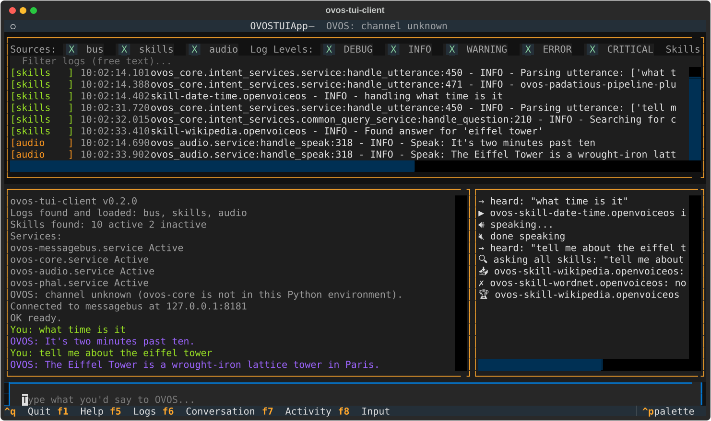

# ovos-tui-client

A split-pane terminal UI for talking to and debugging
[OpenVoiceOS](https://www.openvoiceos.org/) without a microphone or
speaker. You type what you would say, read what OVOS says back, and
watch what happens on the message bus while it happens.

!!! note "This manual describes 0.2.0, currently a pre-release"
    Test runs, scripts, the About windows and the skills window are new
    in 0.2.0. Until it is released, a plain `pip install ovos-tui-client`
    gives you 0.1.x. To get 0.2.0 now:

    ```bash
    pip install --pre -U ovos-tui-client
    ```



## What you get

| | |
|---|---|
| **Logs** | Every OVOS service log it can find, colour-coded by source, filterable by source, level, skill and free text. |
| **Conversation** | What you typed, what OVOS answered, and what *anyone else* said to OVOS (the microphone, HiveMind clients, other TUIs). |
| **Activity** | A readable feed of what happens behind the scenes: which skill is handling the request, which fallback caught it, which answers came back. |
| **Command palette** (`Ctrl+P`) | Everything else, searchable by typing: restart services, activate skills, show the pipeline, run tests, open About windows. |
| **Scripted test runs** | Replay a skill's own golden test utterances, or your own scripts, against your live OVOS and get a ✓/✗ per step. |

## Where to start

- New here? [Getting started](getting-started.md) installs it and walks
  through the screen.
- Want to check whether your skills still answer what they should?
  [Testing skills](testing.md) and [Your own scripts](scripts.md).
- Managing skills: [Skills and About windows](skills.md).
- Several people or devices on one OVOS:
  [Shared bus](shared-bus.md).
- Running it in a browser, or next to a Docker/Podman install:
  [Web and Docker](web-and-docker.md).
- Something looks wrong? [Troubleshooting](troubleshooting.md).

## Why use it

Testing OVOS by voice means wake-word misfires, STT mistakes and no
view of *why* something did or didn't happen. Typing directly and
watching the activity feed skips all of that:

- **See which skill answered, and which ones tried and gave up.**
- **Catch vocabulary gaps** - a phrasing that should work but lands on
  the wrong skill is visible at once.
- **Understand fallbacks** - which fallback skill stepped in, and
  whether it solved anything.
- **Check the intent pipeline order** without reading config files.
- **Restart a stuck service** in two keystrokes.
- **Re-run the same test again and again** after every change.

The source is on
[GitHub](https://github.com/andlo/ovos-tui-client), and releases are on
[PyPI](https://pypi.org/project/ovos-tui-client/).
