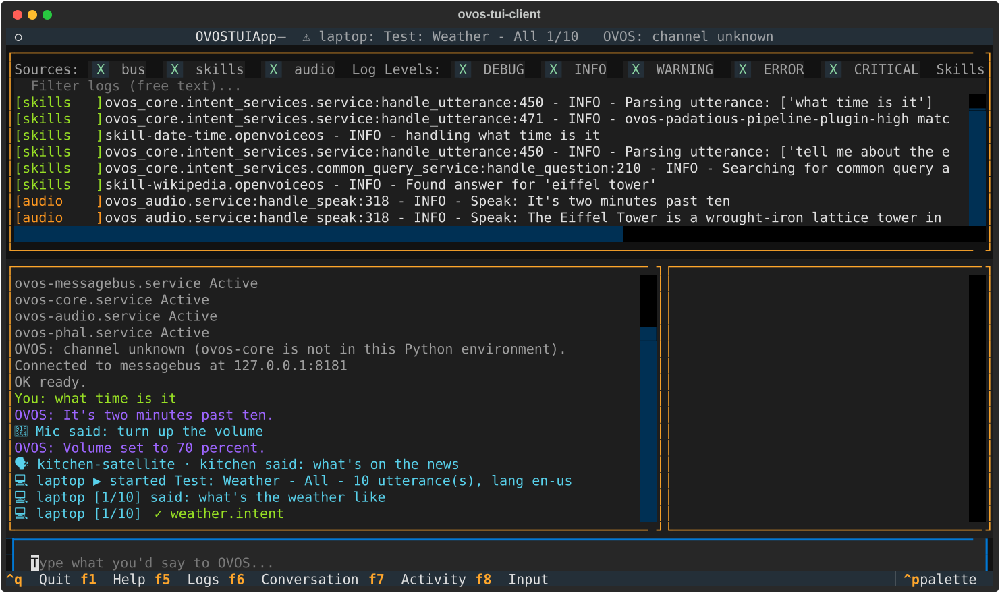

# Shared bus: others talking to OVOS

An OVOS messagebus often has more than one client: the microphone, a
HiveMind satellite in the kitchen, a colleague running their own
ovos-tui-client. The conversation pane shows what **all of them** say
to OVOS, not only what you type:

| Line | Who said it |
|---|---|
| `You: …` | You, in this TUI |
| `🎤 Mic said: …` | The local microphone (the listener) |
| `💻 laptop said: …` | Another ovos-tui-client, on the host `laptop` |
| `🗣 kitchen-satellite · kitchen said: …` | A HiveMind client or other bus client: its name and session |

OVOS's answers are shown as usual.

## Other people's test runs

When another ovos-tui-client runs a test or script, you see it too:

- `💻 laptop ▶ started Test: Weather - All - 10 utterance(s), lang en-us`
- each sentence, numbered: `💻 laptop [1/10] said: …`
- each verdict: `💻 laptop [1/10] ✓ ovos-skill-weather.openvoiceos:weather.intent`
- the summary, and the failures, when it finishes

While it runs, your header shows `⚠ laptop: Test: Weather - All 1/10`,
so you know the replies you see now may not be meant for you.

Nothing else changes for you. You can keep typing, and the other run's
sentences use their own sessions, so they don't get mixed up with your
conversation.
