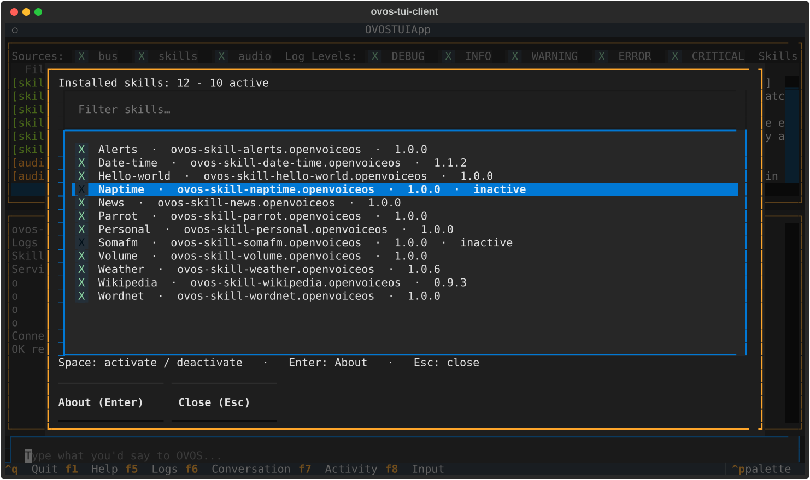
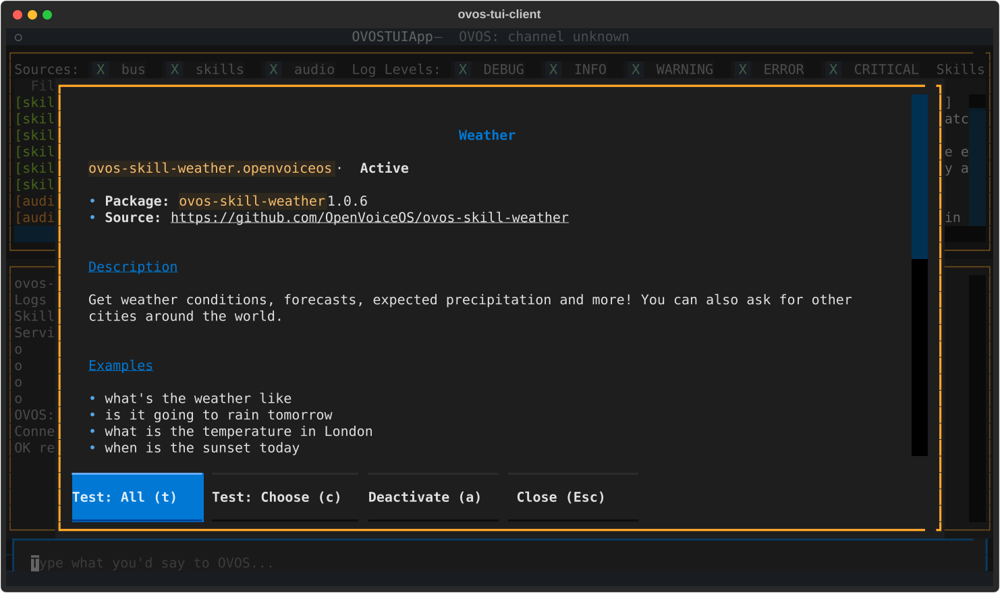
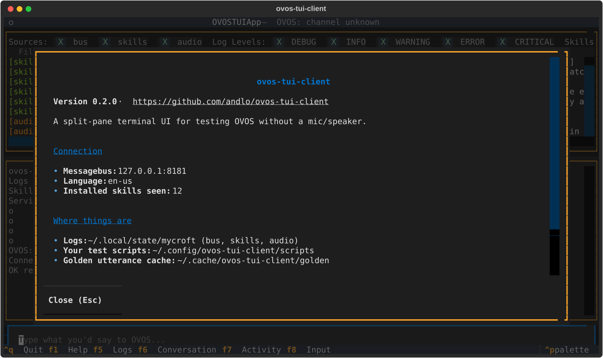

# Skills and About windows

## All installed skills

`Ctrl+P` → **`About: Installed skills (N)`**, or
**`Skill: Activate / deactivate… (N)`**. Both open the same window:

One skill per line: its name, id and installed version. The checkbox
is the skill's **active** state; inactive skills also say `inactive`.

| Key | |
|---|---|
| `Space` | Activate / deactivate the highlighted skill |
| `Enter` | Open the skill's About window |
| typing in the filter | Narrow the list |
| `Esc` | Close |

Activating or deactivating sends the request to OVOS and then asks
OVOS for its skill list again two seconds later. The conversation pane
then says `now active (confirmed by OVOS)`, or `OVOS reports it is
still inactive` if the change didn't happen. The checkbox always shows
what OVOS reports.

!!! note "Deactivated is not uninstalled"
    Deactivating unloads the skill from the running OVOS. The package
    stays installed, and activating it loads it again.

The palette also has one entry per skill,
`Skill: <skill_id> (Active)` / `(Inactive)`, which toggles it directly.

## About a skill

`Ctrl+P` → **`About: <Skill>`**, or `Enter` in the skills list:

It shows what the skill says about itself in its own `skill.json`
(description, example phrases, tags), the installed package and
version, the source repository, and - further down - its **golden test
coverage**: how many test sentences there are per intent, in your
language.

| Key | |
|---|---|
| `t` | `Test: All` for this skill |
| `c` | `Test: Choose` for this skill |
| `a` | Activate / deactivate |
| `Esc` | Close |

The buttons at the bottom do the same.

## About ovos-tui-client

`Ctrl+P` → **`About: ovos-tui-client`** shows the version, which
messagebus and language it uses, and where it found the logs, where
your scripts go and where fetched test sentences are cached.

## Example phrases

Type `example` in the palette to browse the example phrases of all
installed skills, e.g. `Example: weather: what's the weather like`.
Selecting one sends it to OVOS, as if you had typed it.
