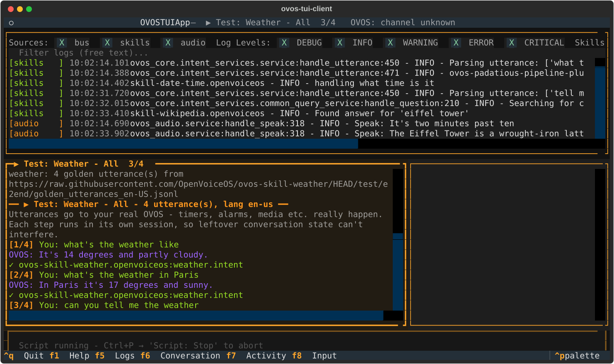
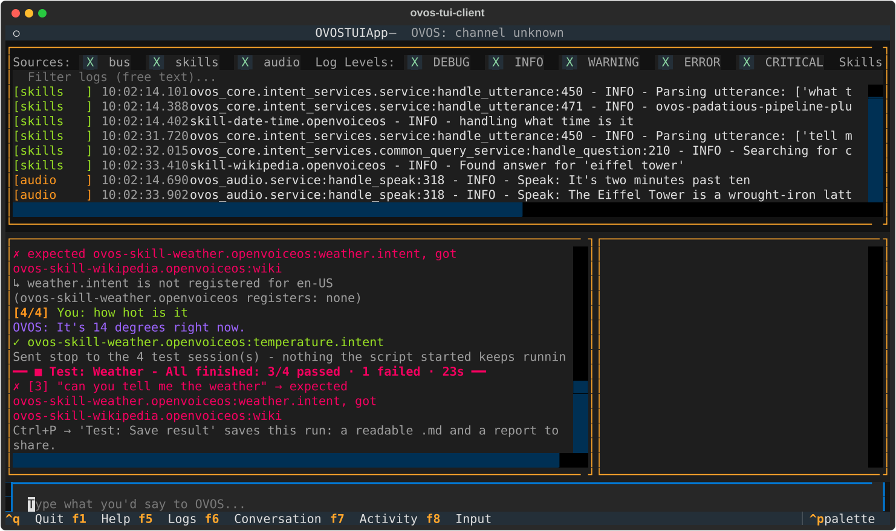
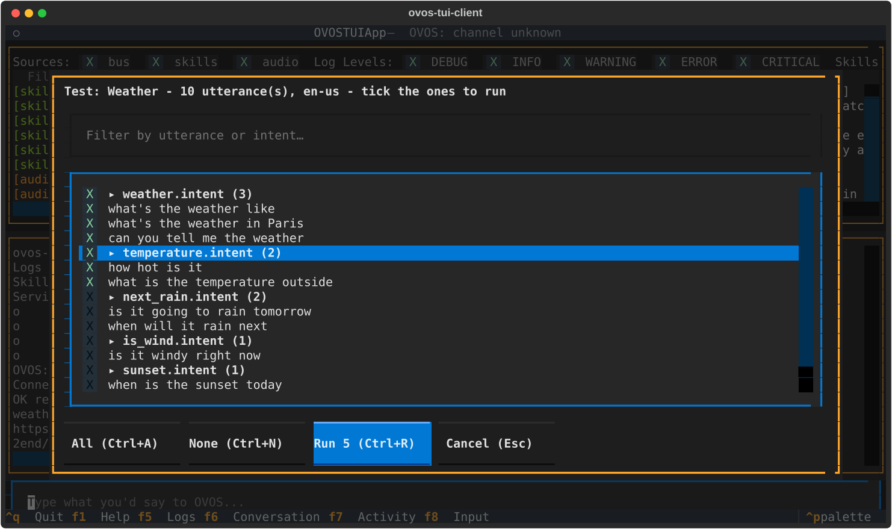

# Testing skills

Most OVOS skills ship a list of **golden utterances**: sentences with
the skill and intent that should handle them. The skill's CI checks
them against the skill alone. ovos-tui-client sends the same sentences
to **your real, running OVOS**, with every other skill, fallback and
pipeline plugin present. That catches what an isolated test can't:
another skill grabbing the sentence, a pipeline plugin getting there
first, or a skill that fails to load.

!!! warning "These are real utterances"
    The test sends the sentences to your live OVOS. Timers, alarms,
    media and so on really happen. When the run ends, the TUI sends
    `stop` to every session the run used, so nothing it started keeps
    running.

## Run all tests for a skill

Open the palette (`Ctrl+P`), type `test` and part of the skill's name,
and pick **`Test: <Skill> - All`**.

While a run is going:

- The conversation pane gets a **heavy yellow border**, and its title
  shows the progress (`▶ Test: Weather - All  3/4`). The header shows
  the same.
- The input box is disabled, so your typing can't get mixed into the
  run. The input's placeholder tells you how to stop the run.
- Each sentence is written as if you typed it, but numbered:
  `[3/4] You: …`. OVOS's reply follows, then the verdict.

| Verdict | Meaning |
|---|---|
| `✓ weather.intent` | The expected skill and intent handled it. |
| `✗ expected …, got …` | Another skill or intent answered. |
| `⏱ no response within the time limit` | Nothing handled it within 30 seconds. |
| `→ <what handled it>` | A script line with no expected skill: nothing to check, but you see who answered. |

The run ends with a summary line and a list of the sentences that
failed:

Here, *"can you tell me the weather"* was picked up by Wikipedia
instead of the weather skill. That is exactly the kind of collision
this is for.

**`Test: All installed skills`** runs every installed skill that has
test utterances, one after the other.

Once a skill has been run, its palette entry shows how many sentences
it has, e.g. `Test: Weather - All (14)`. Skills with nothing to test
in your language disappear from the list after the first try.

## Run only some of the tests

Some skills have more than a hundred sentences. Pick
**`Test: <Skill> - Choose`** to get a checklist:

- Sentences are **grouped by intent**. Ticking a group header ticks the
  whole group.
- Type in the filter box to narrow a long list by sentence or intent
  name. What you already ticked stays ticked.
- `Space` ticks, `Ctrl+A` ticks everything visible, `Ctrl+N` clears,
  `Ctrl+R` (or the Run button) runs, `Esc` cancels.

After a chosen run, two more entries appear in the palette:

- **`Test: <Skill> - Last selection (N)`** runs exactly the same subset
  again, without the window. Handy while you fix one intent and re-test
  it again and again.
- **`Test: <Skill> - Save last selection as script`** saves the subset
  as `<skill>-selection.jsonl` in your scripts folder, so it survives a
  restart as `Script: <skill>-selection`. See [Your own scripts](scripts.md).

You can also start tests from a skill's About window: `t` for All, `c`
for Choose. See [Skills and About windows](skills.md).

## Stop a run

`Ctrl+P` → **`Script: Stop running script`**. The steps that already
ran are still summarised.

## What counts as a pass

Only **routing** is checked: which skill and intent handled the
sentence, not the wording of the reply.

A step is over when OVOS says so (`ovos.utterance.handled` on newer
ovos-core). If that doesn't come, the TUI uses handler-complete or
intent-failure. Failing those, once something has matched, it waits
for a few quiet seconds on the bus; ovos-core 2.1.x sends no end-marker
for pipeline plugins or converse captures. After 30 seconds the step
is marked as timed out. If OVOS started speaking, the TUI also waits
for speech to end, so replies don't overlap.

Each step is sent in **its own OVOS session**, like ovoscope's golden
tests. A skill waiting for an answer in the default session, or the
previous step's follow-up question ("shall I read you this one?"), can
therefore not capture the next step.

A skill stuck waiting in `get_response()` captures every sentence.
That is reported as such, instead of as a plain mismatch.

## Where the test utterances come from

The `test/` folder is not part of an installed skill package, so the
TUI looks in this order:

1. **`--golden-dir DIR`** (can be repeated): local checkouts, as
   `DIR/<skill-repo>/test/end2end/golden_utterances_<lang>.jsonl`. Use
   this while you edit a skill's golden file.
2. **The skill's GitHub repository**, found from the installed
   package's own metadata. The file is fetched fresh on each run and
   cached in `~/.cache/ovos-tui-client/golden/`.
3. **That cache**, when you're offline.
4. **The skill's `skill.json` examples**, if there is no golden file
   anywhere. Examples have no intent label, so they are only checked
   at skill level: "did this skill answer".

The language is the TUI's `--lang`. `da-dk` also finds `da-DK` and
`da` files.

The first line of a run says where the sentences came from, e.g.
`weather: 4 golden utterance(s) from https://raw.githubusercontent.com/…`.
