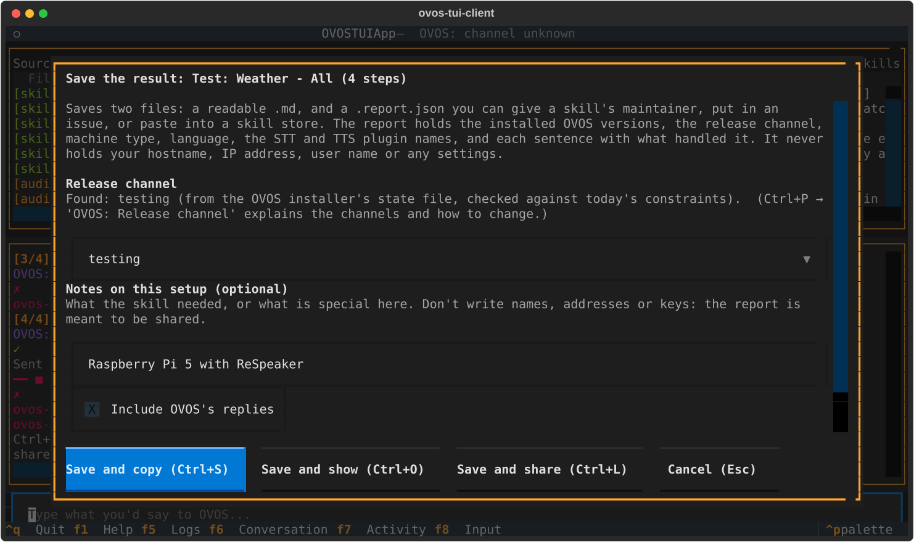
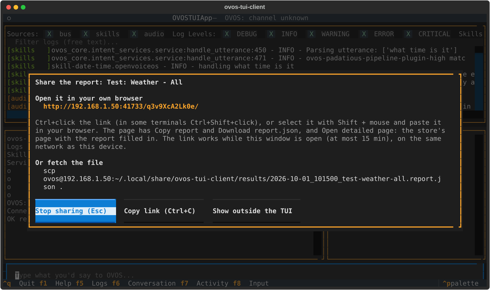
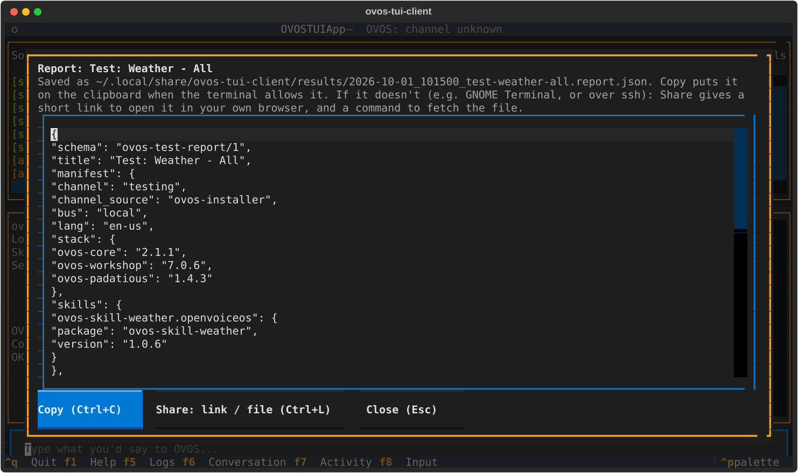
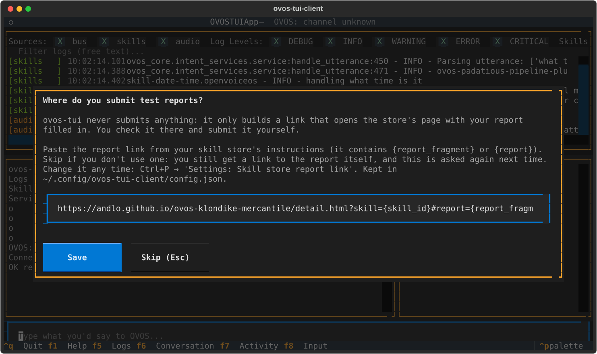

# Testing skills

Most OVOS skills ship a list of **golden utterances**: sentences with
the skill and intent that should handle them. The skill's CI checks
them against the skill alone. ovos-tui-client sends the same sentences
to **your real, running OVOS**, with every other skill, fallback and
pipeline plugin present. That catches what an isolated test can't:
another skill grabbing the sentence, a pipeline plugin getting there
first, or a skill that fails to load.

!!! warning "These are real utterances"
    The test sends the sentences to your live OVOS. Timers, alarms,
    media and so on really happen. When the run ends, the TUI sends
    `stop` to every session the run used, so nothing it started keeps
    running.

## Run all tests for a skill

Open the palette (`Ctrl+P`), type `test` and part of the skill's name,
and pick **`Test: <Skill> - All`**.


While a run is going:

- The conversation pane gets a **heavy yellow border**, and its title
  shows the progress (`▶ Test: Weather - All  3/4`). The header shows
  the same.
- The input box is disabled, so your typing can't get mixed into the
  run. The input's placeholder tells you how to stop the run.
- Each sentence is written as if you typed it, but numbered:
  `[3/4] You: …`. OVOS's reply follows, then the verdict.

| Verdict | Meaning |
|---|---|
| `✓ ovos-skill-weather.openvoiceos:weather.intent` | The expected skill and intent handled it. Without an intent label only the skill is checked and named. |
| `✗ expected …, got …` | Another skill or intent answered. |
| `⏱ no response within the time limit` | Nothing handled it within 30 seconds. |
| `→ <what handled it>` | A script line with no expected skill: nothing to check, but you see who answered. |

The run ends with a summary line and a list of the sentences that
failed:


Here, *"can you tell me the weather"* was picked up by Wikipedia
instead of the weather skill. That is exactly the kind of collision
this is for.

**`Test: All installed skills`** runs every installed skill that has
test utterances, one after the other.

Once a skill has been run, its palette entry shows how many sentences
it has, e.g. `Test: Weather - All (14)`. Skills with nothing to test
in your language disappear from the list after the first try.

## Run only some of the tests

Some skills have more than a hundred sentences. Pick
**`Test: <Skill> - Choose`** to get a checklist:


- Sentences are **grouped by intent**. Ticking a group header ticks the
  whole group.
- Type in the filter box to narrow a long list by sentence or intent
  name. What you already ticked stays ticked.
- `Space` ticks, `Ctrl+A` ticks everything visible, `Ctrl+N` clears,
  `Ctrl+R` (or the Run button) runs, `Esc` cancels.

After a chosen run, two more entries appear in the palette:

- **`Test: <Skill> - Last selection (N)`** runs exactly the same subset
  again, without the window. Handy while you fix one intent and re-test
  it again and again.
- **`Test: <Skill> - Save last selection as script`** saves the subset
  as `<skill>-selection.jsonl` in your scripts folder, so it survives a
  restart as `Script: <skill>-selection`. See [Your own scripts](scripts.md).

You can also start tests from a skill's About window: `t` for All, `c`
for Choose. See [Skills and About windows](skills.md).

## Save the result

After a run, `Ctrl+P` → **`Test: Save result… (<title>)`**. A small window
asks for the three things ovos-tui-client can't know by itself:

- **Release channel:** pre-set to the channel this install runs, and the
  window says how it was found. Change it only if you know better, or
  leave it `unknown`. See [Release channels](channels.md).
- **Notes (optional):** what the skill needed or what is special about the
  setup: `API key set`, `Mark II`, `Raspberry Pi 5 with ReSpeaker`. No names,
  addresses or keys: the report is meant to be shared.
- **Include OVOS's replies:** off. Replies can hold personal data ("14
  degrees in *your town*"), and a store will refuse a report with them.
  Tick it only for a report you keep yourself.

Two files are saved in `~/.local/share/ovos-tui-client/results/`, named by
date, time and title:

- **`….md`**: to read, or paste into an issue as it is: the summary line,
  when it ran, channel and language, the failures, a table of every step
  (expected, what handled it, what OVOS said) and the version of each skill
  tested.
- **`….report.json`**: the report to share with a skill's maintainer or a
  skill store, the same `ovos-test-report/1` file a
  [headless run](headless.md#the-shareable-report) writes: the installed
  versions, the channel, machine type, language, STT and TTS plugin names,
  and each sentence with what handled it; no hostname, IP address, user name
  or settings. Also what to compare two runs with, e.g. testing against
  alpha, or before and after a fix.



The buttons:

- **Save and copy** (`Ctrl+S`): also copies the report to the clipboard.
  Not every terminal passes that on: it uses the OSC 52 escape code, which
  GNOME Terminal / Ptyxis (Fedora's and Ubuntu's default) ignore, over ssh
  or not. If nothing arrives, use Share.
- **Save and show** (`Ctrl+O`): shows the report as text, to read before you
  share it. **Copy** (`Ctrl+C`) there tries the clipboard again, and
  **Share** (`Ctrl+L`) gets it out another way.
- **Save and share** (`Ctrl+L`): gets the report to your own computer, from
  any terminal and over ssh. A window shows:
    - a **short link**: Ctrl+click it (Ctrl+Shift+click in some terminals),
      or select it with Shift + mouse and paste it in your browser. The page
      has **Copy report**, **Download report.json** and, when a store link is
      set, **Open detailed page**, the store's page with the report filled in;
    - an **`scp` command** to fetch the file.

    The link works while the window is open (at most 15 minutes);
    **Stop sharing** (`Esc`) ends it. If your terminal can't click or select
    anything inside an app, **Show outside the TUI** prints the same where the
    terminal's own links and selection work. See
    [Getting the report off the device](headless.md#getting-the-report-off-the-device).

    



`Ctrl+P` → **`Test: Show last result (<title>)`** shows the report again,
and **`Test: Share last result`** shares it. Only the last run can be saved,
and only until the TUI is closed.

### A skill store's report link

The first time you share while no store link is set, the TUI asks for one.
It's the link a skill store gives in its instructions; with it, the share
page gets an **Open detailed page** button that opens the store's page
with your report filled in. ovos-tui-client never submits anything: you
check the report on the store's page and submit it there yourself.



**Skip** if you don't use a store: you still get the link to the report
itself, and it's asked again next time. Set or change it any time with
`Ctrl+P` → **`Settings: Skill store report link`**. It's kept as `submit_url`
in `~/.config/ovos-tui-client/config.json`, shared with
[headless runs](headless.md#a-skill-stores-report-link).

## When OVOS is slow

OVOS handles one sentence at a time. When a step gets no answer in 30
seconds, OVOS is usually still busy with it, e.g. a fallback skill waiting
for an online service, and every sentence sent meanwhile would only queue
up behind it and time out too. So after a timeout the run waits, up to 5
minutes, for OVOS to finish that sentence before it sends the next one, and
says so in the conversation pane. The step still counts as a timeout; its
line says how long OVOS took and what handled it in the end.

## Stop a run

`Ctrl+P` → **`Script: Stop running script`**. The steps that already
ran are still summarised.

## What counts as a pass

Only **routing** is checked: which skill and intent handled the
sentence, not the wording of the reply.

A step is over when OVOS says so (`ovos.utterance.handled` on newer
ovos-core). If that doesn't come, the TUI uses handler-complete or
intent-failure. Failing those, once something has matched, it waits
for a few quiet seconds on the bus; ovos-core 2.1.x sends no end-marker
for pipeline plugins or converse captures. After 30 seconds the step
is marked as timed out. If OVOS started speaking, the TUI also waits
for speech to end, so replies don't overlap.

Each step is sent in **its own OVOS session**, like ovoscope's golden
tests. A skill waiting for an answer in the default session, or the
previous step's follow-up question ("shall I read you this one?"), can
therefore not capture the next step.

**Provider skills behind the reading pipeline** (story and article
skills such as Andersen's tales) never match a sentence themselves: the
common-reading pipeline matches it, asks every provider, and then
fetches the story from the one it picked - after its own handler has
finished. The step waits for that fetch (up to 30 seconds; the pipeline
first announces the story, which can take a while) and counts
it as a pass when the story came from the expected skill. When another
provider was picked, the result says so: `… read from
ovos-skill-grimm-tales.andlo`.

After every step the TUI sends `stop` to that step's own session, so
nothing a step started (a story, "count forever", a metronome) goes on
under the next step. A story can take minutes to read, so once the
step has its verdict the TUI lets the story start and then stops it.

A skill stuck waiting in `get_response()` captures every sentence.
That is reported as such, instead of as a plain mismatch.

## Why a step failed

Right after a failed step, before the next one starts, the TUI asks OVOS
about it and writes a diagnosis under the red line:

```
✗ "what time is it in the kitchen sink please" → ovos-skill-wolfie.openvoiceos
  ↳ what_time_is_it is registered, but padatious scores it 0.92;
    the pipeline has only ovos-padatious-pipeline-plugin-high (≥0.95)
```

It asks which stage and intent would match the sentence now (without
running anything), padatious' best guess and its score, and which
intents the skill registered (per language on ovos-core 3.x; 2.x can't
say for which language). That puts the failure in one of these:

| Category | Means |
|---|---|
| skill not loaded | the expected skill isn't in OVOS' skill list, or is deactivated |
| handler failed | the right intent matched, its handler raised an error |
| matched but silent | the right skill took it and said nothing |
| intent not registered | not for this language (`secondary_langs`?), or not at all |
| below the threshold | padatious scores the right intent, but lower than the padatious stages in the pipeline allow |
| another intent won | who took it instead, and with which stage |
| matches now | it matches correctly when asked again: timing, or an earlier step got in the way |
| unknown | the answers it got are shown |

A padatious score only means something next to the pipeline: padatious
always answers with its best guess, and an intent with a catch-all slot
can score 0.94 on nonsense.

**Known causes.** When the TUI runs on the OVOS machine itself it also
checks known causes, and says `Likely cause: …` when one fits: the OVOS
translate servers being down, a skill implementing stop without
`can_stop` (ovos-workshop 9), ovos-m2v-pipeline answering common query
without speaking (ovos-m2v-pipeline#68), intent lines ending in a slot
on ovos-padatious < 2 (ovos-padatious-pipeline-plugin#175), and two
slots side by side on ovos-workshop 9. These read the skills.log,
installed versions and the skill's `.intent` files. Over a remote bus
it says the cause is unknown and shows what OVOS answered.

The saved result has the same: under each failure in the `.md`, and as
a `diagnosis` (category, the lines, any known cause, and the intent
names and scores it was based on) on that step in the `.report.json`.

## Where the test utterances come from

The `test/` folder is not part of an installed skill package, so the
TUI looks in this order:

1. **`--golden-dir DIR`** (can be repeated): local checkouts, as
   `DIR/<skill-repo>/test/end2end/golden_utterances_<lang>.jsonl`. Use
   this while you edit a skill's golden file.
2. **The skill's GitHub repository, at the tag of the installed
   version** (`v0.4.20`, `V0.4.20` or `0.4.20`), found from the
   installed package's own metadata. That way the sentences and intent
   names match the code that answers them, also on a channel that runs
   an older release. The file is fetched fresh on each run and cached
   in `~/.cache/ovos-tui-client/golden/`.
   - If that release ships no golden file, the TUI uses the skill's
     `skill.json` examples (step 4) instead of the newest file, which
     may describe intents the installed version doesn't have.
   - Only when the installed version has no tag (a git install, say),
     or the tags can't be read, is the repository's default branch
     used. A headless report notes that in `steps_note`.
3. **That cache**, when you're offline.
4. **The skill's `skill.json` examples**, if there is no golden file
   for the installed version. Examples have no intent label, so they
   are only checked at skill level: "did this skill answer".

The language is the TUI's `--lang`. `da-dk` also finds `da-DK` and
`da` files.

The first line of a run says where the sentences came from, e.g.
`weather: 4 golden utterance(s) from https://raw.githubusercontent.com/…`.
